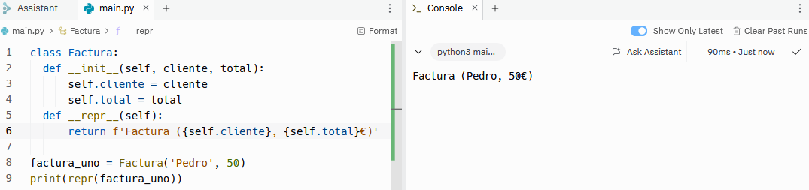

# Clases
Una clase es una estructura que permite almacenar datos y funciones. Las clases funcionan como plantillas que permiten crear objetos concretos a partir de esos datos y funciones. Estos objetos que se crean a partir de la clase son conocidos como instancias, por lo que al proceso de crear un nuevo objeto o instancia se le conoce como instanciar. Cada objeto tendrá unos valores diferentes para los datos, pero todos ellos tendrán las mismas funciones y la misma estructura de datos. 

Las clases en Python se definen utilizando la palabra ```class``` seguido del nombre de la clase con la primera letra en mayúscula, y dos puntos (```:```). A continuación, se indican las funciones que queramos añadir. Veámos esto con un ejemplo:
```sh
class Factura:
    def saludo(self):
        return 'Hola!'
```
Como se observa en el ejemplo, la clase es 'Factura' y tiene una función de 'saludo' que devuelve un 'Hola!'. Las funciones que se escriben dentro de una clase tienen un argumento por defecto que es ```self```, y, aparte de ese, se pueden añadir los que queramos. Esta clase por si sola no devuelve ningún valor, para ello hay que crear un objeto o instancia. 
```sh
class Factura:
    def saludo(self):
        return 'Hola!'

factura_uno = Factura()
print(factura_uno.saludo())
```


La forma de crear una instancia es creando una variable que sea igual al nombre de la clase y, entre paréntesis los argumentos, si los tuviera. En el ejemplo anterior, como solo tiene el arguemnto por defecto, no se pasa ningún argumento. Para que nos devuelva lo que le pedimos en la clase tenemos que escribir ```print``` y entre paréntesis llamar a la variable que acabamos de crear (```factura_uno```) seguido de un punto (```.```) y la función que habíamos creado en la clase (```saludo()```).

# Método \_\_init\_\_
El método init es una función dunder que se ejecuta automáticamente al crear una instancia u objeto. Gracias a este método los atributos del objeto creado se inician automáticamente. Esta función es la primera que se declara dentro de una clase y se escribe con dos barras bajas antes y después de la palabra init (```__init__```).
```sh
class Email:
    def __init__(self, nombre, apellido):
        self.nombre = nombre
        self.apellido = apellido
    def saludo(self):
        return f'Hola {self.nombre} {self.apellido}'

email_uno = Email('Pedro', 'García')
print(email_uno.saludo())
```


Al crear la instancia se activan automáticamente el nombre y el apellido que, posteriormente, serán utilizados en la función 'saludo'. Estos atributos se podrán definir al crear cada instancia, en el caso anterior, el nombre es Pedro y el apellido García. 

# Métodos dunder
Los métodos dunder son funciones predefinidas en Python que se utilizan para ejecutar determinadas tareas sin tener que crear una función entera para ello. Se distinguen del resto de métodos o funciones porque tienen dos barras bajas al comienzo y al final del nombre de la función. Por ejemplo, un método dunder que ya hemos visto anteriormente es ```__init__```. Estas funciones están diseñadas para utilizarse directamente, por lo que no se deben de sobreescribir. Como ya hemos visto el método ```__init__```, vamos a ver otros dos métodos dunder.

## \_\_str\_\_
Este método se utiliza para visualizar los detalles de un objeto dentro de una clase, es decir, devuelve una cadena en la que se reflejan los valores de un objeto de forma que resulten sencillos de leer. De esta forma, el cliente o usuario de la aplicación puede entender de manera sencilla lo que devuelva la función, y el programador puede encontrar errores con mayor facilidad. 
```sh
class Factura:
    def __init__(self, cliente, total):
        self.cliente = cliente
        self.total = total
    def __str__(self):
        return f'Factura de {self.cliente} de {self.total}€'

factura_uno = Factura('Pedro', 50)
print(str(factura_uno))
```


## \_\_repr\_\_
Otro método dunder es el ```__repr__```. Este tiene una función similar al anterior, pero en lugar de estar orientado a una lectura sencilla para el cliente o usuario, está orientado a programadores. También se utiliza una cadena, pero con una sintaxis más esquemática que cualquier programador pueda entender. Mediante este método dunder también se pueden depurar errores. 
```sh
class Factura:
    def __init__(self, cliente, total):
        self.cliente = cliente
        self.total = total
    def __repr__(self):
        return f'Factura ({self.cliente}, {self.total}€)'

factura_uno = Factura('Pedro', 50)
print(repr(factura_uno))
```


# Decoradores en Python
A partir de los objetos o instancias de las clases se pueden obtener y establecer datos. Partiendo de la siguiente clase:
```sh
class Email:
    def __init__(self, nombre, apellido):
        self.nombre = nombre
        self.apellido = apellido
    def saludo(self):
        return f'Hola {self.nombre} {self.apellido}'

email_uno = Email('Pedro', 'García')
```
La forma convencional de obtener datos es la siguiente:
```sh
print(email_uno.nombre)
print(email_uno.apellido)
```


Y la forma convencional de sobreescribir o establecer datos es la siguiente:
```sh
email_uno.nombre = 'Juan'
print(email_uno.nombre)
```


Como se puede observar, tras establecer el nombre como Juan, deja de ser Pedro. 

Esta forma de obtener y establecer datos se considera pobre, ya que a veces podrían dar lugar a errores si se sobreescriben variables que no se deben de sobreescribir. Por ello, existe otra forma de obtener y establecer datos en la que se utilizan los decoradores de propiedad. Los decoradores de propiedad son una forma de comunicarse con otros desarrolladores. Hay dos formas de proteger nuestros datos y se utilizará una u otra en función de la funcionalidad deseada.
- Protect: si hay clases anidadas en una clase principal, las clases hijas tendrán acceso a los datos de la clase principal. Para indicar que un conjunto de datos está protegido se utiliza un guión bajo delante del atributo (```self._nombre```).
- Private: aunque haya clases anidadas en una clase principal, solo la clase principal tendrá acceso a los datos. Para indicar que un conjunto de datos es privado se utilizan dos barras bajas antes del atributo (```self.__nombre```).

Los guiones bajos no afectan al código, solamente indica a los desarrolladores cómo deben tratar los datos. Por tanto, vamos a ver cómo podemos obtener y establecer datos utilizando los decoradores de propiedad. En primer lugar, se pueden obtener datos de la siguiente manera:
```sh
class Email:
    def __init__(self, nombre, apellido):
        self._nombre = nombre
        self._apellido = apellido
    def saludo(self):
        return f'Hola {self._nombre} {self._apellido}'
    
    @property
    def nombre(self):
        return self._nombre

email_uno = Email('Pedro', 'García')
print(email_uno.nombre)
```


Como se puede observar, se crea un decorador de propiedad que indica que la clase está pensada para que se pueda obtener el nombre del cliente, porque hay una función creada expresamente para ello. 
Para establecer datos se haría de la siguiente forma:
```sh
class Email:
    def __init__(self, nombre, apellido):
        self._nombre = nombre
        self._apellido = apellido
    def saludo(self):
        return f'Hola {self._nombre} {self._apellido}'
    
    @property
    def nombre(self):
        return self._nombre

    @nombre.setter
    def nombre(self, nombre):
        self._nombre = nombre

email_uno = Email('Pedro', 'García')
email_uno.nombre = 'Juan'

print(email_uno.nombre)
```


En primer lugar, hay que crear el decorador de propiedad para obtener el nombre del cliente y, en segundo lugar, al decorador de propiedad para sobreescribir el nombre del cliente a 'Juan'. Una vez más, esta sintaxis le indica al desarrollador que está permitido sobreescribir el nombre del cliente sin crear ningún error. 

# Polimorfismos
Los polimorfismos en Python son funciones genéricas escritas en una clase que se utilizan en varias subclases y, en cada una, tiene un comportamiento diferente. Para hablar de polimorfismos es importante hablar primero de herencia. La herencia se utiliza cuando queremos varias subclases que parten de una clase principal y que, por tanto, heredan al menos cierto comportamiento de la clase principal. Vamos a crear una clase:
```sh
class Usuario:
    def __init__(self, nombre, apellido):
        self.nombre = nombre
        self.apellido = apellido
    def saludo(self):
        return 'Bienvenido!'
```
Y ahora crearemos una subclase que tenga acceso a esa clase y varios objetos:
```sh
class UsuarioAdmin(Usuario):
    def nuevo_admin(self):
        return f'Hola {self.nombre} {self.apellido}, ahora eres administrador'

pedro = Usuario('Pedro', 'García')
juan = UsuarioAdmin('Juan', 'Pérez')
```
Si le pedimos que ejecute las funciones saludo y nuevo_admin con juan, vamos a ver que ejecuta las dos sin problema, ya que 'juan' es ```UsuarioAdmin``` y tiene acceso a la clase ```Usuario```


Sin embargo, si realizamos la misma acción con el objeto 'pedro', que solamente es ```Usuario```, observamos cómo tiene acceso a la función saludo, pero no a la función nuevo_admin.


Esto es importante a la hora de entender cómo funcionan los polimorfismos, ya que vamos a tener una clase principal con una función que van a heredar varias subclases. Y el resultado de esa misma función cambiará en función de la subclase. Vamos a imaginar que tenemos una aplicación a la que tienen acceso varios tipos de usuarios y queremos crear un saludo diferente.
```sh
class Usuario:
    def __init__(self, nombre, apellido):
        self.nombre = nombre
        self.apellido = apellido
    def saludo(self):
        raise NotImplementedError('Subclass must be implemented')

class NuevoUsuario(Usuario):
    def saludo(self):
        return f'Bienvenid@ a la aplicación {self.nombre} {self.apellido}'

class UsuarioNormal(Usuario):
    def saludo(self):
        return f'Hola {self.nombre} {self.apellido}'

class UsuarioAdmin(Usuario):
    def saludo(self):
        return f'Hola {self.nombre} {self.apellido}, ahora eres administrador'

tags = [
    NuevoUsuario('María', 'López'),
    UsuarioNormal('Pedro', 'García'),
    UsuarioAdmin('Juan', 'Pérez')
]

for tag in tags:
    print(tag.saludo())
```
Si ejecutamos el código anterior, 


Como se puede observar, todas las subclases tienen acceso a la clase principal, de la cual obtienen el nombre y el apellido del usuario. Y cada subclase va sobreescribiendo el comportamiento de una misma función (```saludo```). Los polimorfismos son útiles cuando hay muchas funciones compartidas entre la clase principal y las subclases, ya que permite ahorrar bastantes líneas de código. Como se puede observar, se escribe el método \_\_init_\_ una sola vez y luego todas las subclases lo van heredando.

# API
API son las siglas de Application Programming Interface. Es el nexo de unión entre dos aplicaciones que necesitan comunicarse entre sí para compartir información y funcionalidades, en otras palabras, es la forma de comunicación entre dos aplicaciones. Existen diferentes plataformas que ayudan a crear y utilizar APIs, una de ellas es Postman, hablaremos de ella más adelante. La manera en la que se comunican dos aplicaciones es mediante verbos que definen acciones. Estos verbos permitem obtener (```GET```), actualizar (```PUT/PATCH```), crear (```POST```) y borrar (```DELETE```) información desde una aplicación a otra aplicación.
Vamos a suponer que hemos creado una aplicación con Python en la que se pueden visualizar diversas guías, y queremos realizar las acciones anteriores.

## GET
Get permite consultar información de una aplicación sin alterar el funcionamiento de la misma. El código que hay que escribir en nuestra aplicación de Python es el siguiente:
```sh
@app.route("/guides", methods=["GET"])
def get_guides():
    all_guides = Guide.query.all()
    result = guides_schema.dump(all_guides)
    return jsonify(result)
```
Como se observa, creamos un decorador que contiene la ruta en la cual vamos a encontrar la información que queremos obtener (```/guides```) y el método o función que queremos utilizar, en este caso, ```GET```. Posteriormente, hay que escribir la función que devolverá toda la información solicitada. Esta función dependerá de la aplicación que hayamos creado.

## PUT/PATCH
PUT y PATCH tienen un uso similar. PUT se utiliza para sustituir por completo una información, mientras que PATCH se utiliza para actualizar algunos elementos.
```sh
@app.route("/guide/<id>", methods=["PUT"])
def guide_update(id):
    guide = Guide.query.get(id)
    title = request.json['title']
    content = request.json['content']

    guide.title = title
    guide.content = content

    db.session.commit()
    return guide_schema.jsonify(guide)
```
Mediante el código anterior podremos actualizar la guía completa. Como se puede observar la ruta utilizada es ```/guide/<id>``` y el método ```PUT```. El ```id``` indicará cual es la guía que queremos actualizar. 

## POST
Se utiliza para crear nuevos recursos o información en una aplicación. Si queremos crear una nueva guía en nuestra aplicación, el código a utilizar será el siguiente:
```sh
@app.route('/guide', methods=["POST"])
def add_guide():
    title = request.json['title']
    content = request.json['content']

    new_guide = Guide(title, content)

    db.session.add(new_guide)
    db.session.commit()

    guide = Guide.query.get(new_guide.id)

    return guide_schema.jsonify(guide)
```
En este caso la ruta utilizada es ```/guide``` y el método ```POST```.

## DELETE
Este verbo se utiliza para eliminar información de nuestra aplicación.
```sh
@app.route("/guide/<id>", methods=["DELETE"])
def guide_delete(id):
    guide = Guide.query.get(id)

    db.session.delete(guide)
    db.session .commit()

    return "La guía se ha eliminado correctamente"
```
De nuevo hay que incluir una ```id``` para especificar cuál es la guía que queremos eliminar. En este caso es conveniente que el sistema devuelva una cadena como ```La guía se ha eliminado correctamente``` para que el desarrollador pueda saber que el sistema ha realizado la acción.

# Postman
Todo lo anterior se puede realizar de manera sencilla utilizando Postman. Como ya he comentado, Postman es una aplicación que permite crear y utilizar APIs. Para utilizar Postman con aplicaciones locales que tengamos en el ordenador, tendremos que descargar la versión de escritorio. Para utilizar la aplicación de Python que hemos creado anteriormente, hay que abrir el ambiente de trabajo mediante ```pipenv shell``` y, posteriormente, el archivo Python con la aplicación. 


El 5000 subrayado en la imagen con color azul indica el servidor. Este número es importante porque es el que hay que colocar en la ruta si queremos hacer una petición a una aplicación local. En caso de que queramos hacer una petición a cualquier página web, simplemente tenemos que colocar la URL. Para obtener información de nuestra aplicación:


Como se puede observar arriba a la izquierda hay que seleccionar GET e introducir la ruta al archivo local ```localhost:5000/guides```. Esto nos devuelve todas las guías que tengamos creadas. 

También se puede actualizar contenido seleccionando PUT y cambiando la ruta a ```/guide/2```, por ejemplo:


Añadir contenido con POST y ```/guides```:


Y borrar contenido con DELETE y ```/guide/5```:


# MongoDB
Mongo DB es una aplicación que permite crear y gestionar bases de datos NoSQL. Hay dos tipos de bases de datos, las SQL y las NoSQL. En las SQL los datos se almacenan en tablas siguiendo un modelo relacional, mientras que en las NoSQL los datos se almacenan en un formato no tabular. Si los datos que se van a utilizar están estructurados y existe relación entre ellos, probablemente queramos utilizar las bases de datos SQL. Sin embargo, si los datos no están estructurados y queremos una mayor flexibilidad en el tratamiento de datos, entonces será mejor utilizar NoSQL.
MongoDB trabaja con colecciones en lugar de con tablas, por tanto, con NoSQL. Para crear una colección hay que abrir la consola de MongoDB (```mongosh```) y escribir ```db.createCollection``` y el nombre de la colección entre paréntesis, por ejemplo: ```db.createCollection('libros')```. Dentro de esa colección podemos añadir los documentos que queramos. Para añadir un documento utilizaremos el siguiente código: 
```sh
db.books.insertOne({
    "título": "Fundamentos de Programación",
    "fecha de publicación": new Date(),
    "autores": [
        {"nombre": "Pedro"},
    ]
})
```
Una de las ventajas de las bases de datos NoSQL es que en cada documento podemos tener diferentes palabras clave, es decir, en otro documento, aparte del título, la fecha de publicación y los autores, podríamos tener el número de páginas. Sin embargo, hay que tener cuidado con esto porque podríamos crear errores. 

Además de crear documentos, se pueden consultar utilizando ```db.libros.find()``` si queremos consultar todos los documentos, o ```db.libros.find(título: "Fundamentos de Programación")``` si queremos buscar ese libro por título. Si queremos realizar esta misma acción en una base de datos SQL tendríamos que escribir ```SELECT * from libros WHERE título = 'Fundamentos de Programación'```. 
También se pueden consultar solo algunos atributos del documento. Para ello se utiliza el siguiente código:
```sh
db.libros.find(
    {título: "Fundamentos de Programación"},
    {_id: 0,
    título: 1,
    autores: 1}
)
```
En este caso, del libro 'Fundamentos de Programación' queremos obtener el título y los autores y, para ello, utilizamos un 1. El id del documento lo da siempre por defecto, por lo que si no lo queremos tendremos que poner ```id: 0```.

Finalmente, se pueden eliminar varios documentos con ```db.libros.deleteMany({título: "Fundamentos de Programación})```, que elimina todos los libros con ese título, o ```db.libros.deleteOne({título: "Fundamentos de Programación})``` que elimina solo el primer libro con ese título. 